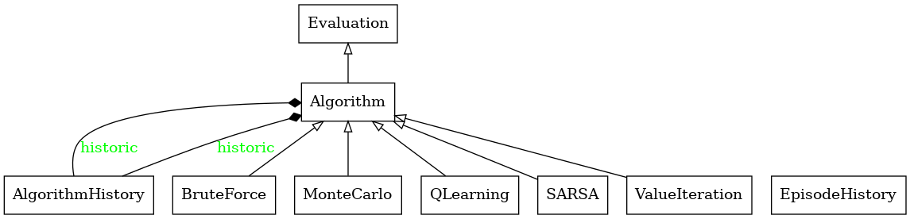
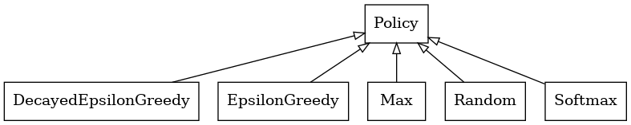
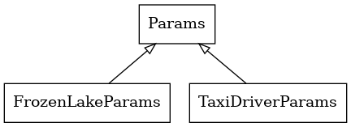
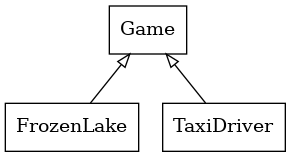

# T-AIA-902

> _Un projet de de recherche et de découverte du domaine du traitement de l'apprentissage renforcé (RL), de ses applications et de 
ses outils développés au fil des avancées de la recherche._

## Sommaire
- [Groupe](#groupe)
- [Le projet](#le-projet)
  - [Contexte](#contexte)
  - [Architecture](#architecture)
  - [Installation](#installation)
  - [Mode utilisateur](#mode-utilisateur)
  - [Exemples d'utilisation](#exemples-dutilisation)
- [Rapport](#rapport)

## Groupe

Le groupe ayant réalisé l'ensemble du travail de recherche et de développement est composé de 4 membres :
- Eliott CLAVIER
- Marius GLO
- Elie MORICEAU
- Clément MATHÉ
- Paul RIPAULT

## Le projet

### Contexte

Le projet __T-AIA-902__ a pour but de concevoir une solution permettant de résoudre un environnement modélisant un taxi.
Ce taxi doit aller chercher un passager, puis l'ammener et le déposer à l'endroit indiqué. Pour résoudre ce problème, 
des techniques d'apprentissage existe afin d'entrainer un agent (le taxi) en foncton d'un environnement donné.

_L'environnement utilisé tout au long du projet est issu de l'API Gym réalisée par OpenAI: Taxi._

Notre approche de résolution s’est reposée sur une exploration approfondie des technologies de pointe en matière de RL. 
Cette exploration nous a d'abord conduits à implémenter plusieurs algorithmes connus. 
Nous avons ensuite manipuler ses algorithmes tout en menant des tâches d' __optimisation d'hyperparamètres__ pour trouver
les paramètres optimaux pour chaque algorithme permettant d'obtenir les meilleurs résultats, en termes de convergence,
de performance et de temps d'entrainement.


### Architecture

Afin de gagner en lisibilité et en efficacité, l'ensemble des éléments nécessaires à la résolution de l'environnement
Taxi Driver ont été architecturé de façon à être modulaire et réutilisable.









Ci-dessus, les diagrammes de classes simplifiés des différents éléments de notre architecture.
On peut y voir les classes des algorithmes, des politiques et des paramètres utilisés pour l'entrainement de notre agent.

Les algorithmes implémentés sont les suivants :
- Brute Force
- SARSA
- QLearning
- MonteCarlo
- ValueIteration
- DeepQLearning

Chacun de ces algorithmes hérite de la classe abstraite `Algorithm` qui définit plusieurs méthodes permettant d'entrainer 
et de sauvegarder les résultats de l'entrainement. Cette classe hérite elle-même de la classe `Evaluation`
qui implémente des méthodes permettant de tester un agent entrainé sur un environnement donné.

Les politiques sont des classes permettant de définir le comportement de l'agent lors de l'exploration de l'environnement.
Nous avons implémenté les politiques suivantes :
- EpsilonGreedy
- DecayEpsilonGreedy
- Max
- Random
- Softmax

Chacune de ces politiques hérite de la classe abstraite `Policy` qui définit une méthode à implémenter dans chaque enfant
permettant de choisir une action à partir d'un état donné.

Enfin, les hyperparamètres utilisés pour l'entrainement de l'agent sont définis dans la classe `Params` qui permet de stocker
et de manipuler les hyperparamètres de chaque algorithme. Les classes `TaxiDriverParams` et `FrozenLakeParams` héritent de `Params`
et définissent les hyperparamètres spécifiques à chaque environnement.

__Il est important de préciser que la modularité de notre architecture 
permet d'entrainer des agents sur les environnements FrozenLake et TaxiDriver de l'API Gym.__

_Les diagrammes de classes détaillés sont disponibles dans le dossier `docs` du projet. Ces diagrammes ont été générés à l'aide de l'outil `pyreverse` et `graphviz`
à partir du code source de notre projet disponible dans le dossier `common`._

### Installation

Dans le répertoire racine du projet, exécutez la suite de commandes qui suit, en notant qu'il est recommandé d'utiliser [Python 3.12.4](https://www.python.org/downloads/release/python-3124/).

Pour faire fonctionner le projet, il faut d'abord installer __pipx__ avec les commandes suivantes :
```powershell
python -m pip install --user pipx
python -m pipx ensurepath
``` 

Il vous faudra ensuite installer __poetry__ [selon votre configuration](https://python-poetry.org/docs/). La commande par défaut est la suivante :
```powershell
pipx install poetry
```

__La version vérifiée de poetry pour ce projet est la 1.8.3.__

Une fois poetry installé, il faut ensuite installer les dépendances du projet avec la commande suivante :
```powershell
poetry install
```

Il est aussi possible de mettre à jour les dépendances du projet avec la commande suivante :
```powershell
poetry update
```

_Il est recommandé d'utiliser un environnement virtuel dans lequel installer les dépendances du projet._

### Mode utilisateur

Pour faciliter l'utilisation de notre architecture, nous avons mis en place un mode utilisateur en CLI permettant de lancer des entrainements
et des tests sur les différents algorithmes et politiques implémentés. Ce mode utilisateur est accessible via le script `launch_user_mode.py` et
permet les actions suivantes :
- Configuration de l'algorithme à utiliser, de l'environnement, de la politique et des hyperparamètres
- Sauvegarde de la configuration dans un fichier JSON
- Chargement de la configuration depuis un fichier JSON
- Entrainement de l'agent selon la configuration chargée (qui affiche et sauvegarde les résultats de l'entrainement, à savoir le modèle, les métriques et quelques épisodes réalisés au cours de l'entrainement) 
- Visionnage d'épisodes sauvegardés lors du dernier entrainement effectué
- Test d'un agent entrainé sur l'environnement choisi en configuration

_Le mode utilisateur à été réalisé à partir de la librarie `Inquirer.py` qui permet de créer des interfaces utilisateur en ligne de commande._

### Exemples d'utilisation

En plus du mode utilisateur, il est possible d'expérimenter notre architecture par le biais de scripts Python, en important 
les classes et fonctions nécessaires à l'entrainement et au test des agents depuis le module `common`.

Les dossiers `taxi_driver` et `bootstrap` contiennent des fichiers `gymm.py` servant d'exemples 
d'utilisation de notre architecture pour l'entrainement et le test  d'agents sur l'environnement Taxi Driver et Frozen Lake.

## Rapport

L'ensemble de notre travail de recherche et d'exploration des technologies de RL est détaillé dans le rapport de projet
disponible dans le fichier `rapport_rl.pdf`. 

Ce rapport traite d'abord de l'environnement Taxi Driver, de son fonctionnement et de pourquoi il est intéressant à utiliser pour nos recherches.

Une grande partie du rapport est dédiée à la présentation des résultats de nos modèles à savoir l'impact de l'utilisation d'algorithmes
différents (SARSA, Monte-Carlo, Q-Learning...). 

Le rapport conclu sur les intérêts et résultats que nous avons obtenu après avoir tester les différents modèles dans notre environnement.
